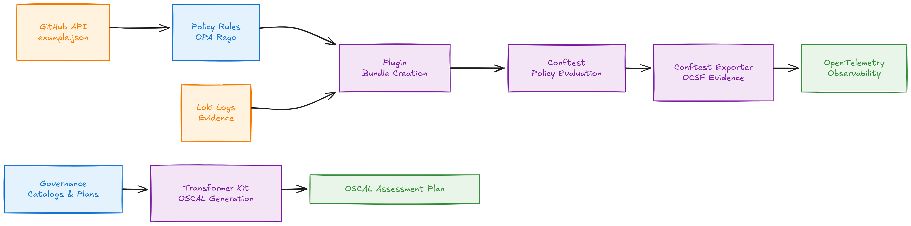

# opensource-securitycon-2025-oscal-in-action

This demo repository contains the official content for the OpenSource SecurityCon presentation - **OSCAL in Action:** Real World Examples of Automating Policy &amp; Compliance

## Key Concepts 

1. **Governance → OSCAL**: Control catalogs and assessment plans are transformed into structured OSCAL documentation
2. **Policy → Validation**: OPA Rego policies validate against GitHub API data
3. **Evidence Collection**: Plugin system gathers evidence from Loki and creates policy bundles
4. **Evidence Processing**: Conftest exporter converts results to OCSF format for audit trails
5. **Observability**: OpenTelemetry collects all evidence and provides continuous monitoring

This repository demonstrates a complete **compliance-as-code** implementation using industry standards (OSCAL, OPA, OpenTelemetry) to automate policy enforcement and evidence collection.
 

## Component Workflow Description

### 1. Governance `governance/`

- **Control Catalogs (cnscc.yaml)**: Contains [Cloud Native Security Controls Catalog](https://docs.google.com/spreadsheets/d/1GUohOTlLw9FKUQ3O23X7ypvJLXN-B3veJGe6YE6JYfU/edit?gid=1938257679#gid=1938257679) with NIST 800-53 mappings

**Example `governance/catalog` yaml**

```yaml
      - id: CNSCC-SSC-03
        title: Enforce full attestation and verification for protected branches
        objective: |
          Branch protection is enabled on the mainline and release branches with force push disabled
          to ensure proper review and verification processes.
        guideline-mappings:
          - reference-id: 800-53
            entries:
              - reference-id: AC-6(3)
        assessment-requirements:
          - id: CNSCC-SSC-03.01
            text: |
              Branch protection is enabled on the mainline and release branches with force push disabled.
              This ensures proper review and verification processes are followed.
            applicability:
              - tlp_clear
              - tlp_green
              - tlp_amber
              - tlp_red
            recommendation: Enable branch protection with force push disabled
```

- **Assessment Plans (cnscc.yaml)**: Defines evaluation procedures and assessment requirements

**Example `governance/plans` yaml**

```yaml
- control-id: CNSCC-SSC-01
    assessments:
      - requirement-id: CNSCC-SSC-01.01
        procedures:
          - id: "github_branch_protection"
            name: "GitHub API Verifications for Branch Protection"
            description: The procedure performs an automated check of the branch ruleset state in GitHub by creating a snapshot of the state from the API and checks the output with an OPA policy to ensure the outcome meets the baseline requirement.
```

- **Policy Definition (policy.yaml)**: Organization-specific policy rules and control modifications

> Note: The organizational policy rules and control modifications map back to the definition of [Layer 3 Policy](https://github.com/ossf/gemara/tree/main?tab=readme-ov-file#layer-3-policy) in the OpenSSF `gemara` project.

### 2. Policy Checks `checks/`

- **OPA Rego Policies**: Implements policy validation logic (e.g., GitHub branch protection requirements)

**Example `rego` policy checks for enforcement of organizational policy.**

```rego
deny contains result if {
    not has_pull_request_rule
    
    chain := rego.metadata.chain()
    annotations := chain[0].annotations
    
    result := {
        "short_name": annotations.custom.short_name,
        "msg": "A branch protection rule of type 'pull_request' is required but was not found."
    }
}
```

- **Test Data (example.json)**: Sample GitHub API responses used for policy validation

### 3. Transformer Kit `cmd/transformer-kit/`

- **OSCAL Transformer**: Converts Gemara governance artifacts to OSCAL Assessment Plans
- **Generated Assessment Plan**: Outputs structured OSCAL-compliant assessment documentation

### 4. Plugin System `cmd/plugin/`

- **OPA/Loki Plugin**: Creates policy bundles and collects evidence from [Loki](https://github.com/grafana/loki) logs
- **Policy Bundle**: Compiled [OPA](https://www.openpolicyagent.org/) policies ready for deployment
- **Loki Logs**: Centralized evidence storage with policy ID tracking

### 5. Conftest Exporter

- **Conftest Results**: Policy evaluation output in JSON format
- **OCSF Evidence**: Structured evidence in Open Cybersecurity Schema Framework format
- **[ProofWatch](https://github.com/complytime/complybeacon/tree/main/proofwatch)**: Evidence collection and audit trail management

### 6. External Systems

- **GitHub API**: Source of truth for repository configuration state
- **OpenTelemetry**: Observability stack for metrics, traces, and logging

## Key Workflows

1. **Policy Definition**: Governance artifacts define controls and assessment procedures
2. **Policy Implementation**: OPA Rego policies implement validation logic
3. **Evidence Collection**: Plugin system gathers evidence from various sources (GitHub, Loki)
4. **Policy Evaluation**: Conftest evaluates policies against collected evidence
5. **Evidence Export**: Results are structured and exported via OpenTelemetry
6. **OSCAL Generation**: Transformer kit creates OSCAL-compliant assessment plans



## Relevant Links

### Open Source Projects

- Open Policy Agent
- OpenTelemetry
- OSCAL Compass
- Grafana Loki

<!-- ### Where to Find Us -->

<!-- - Community meeting placeholder -->
